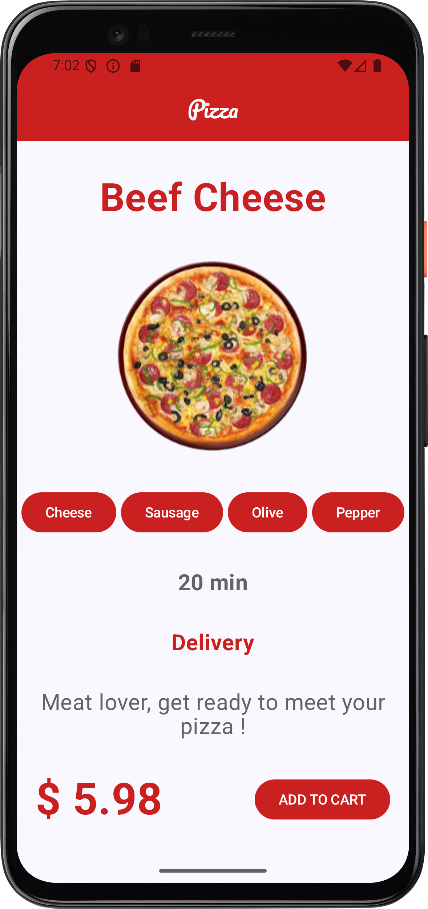
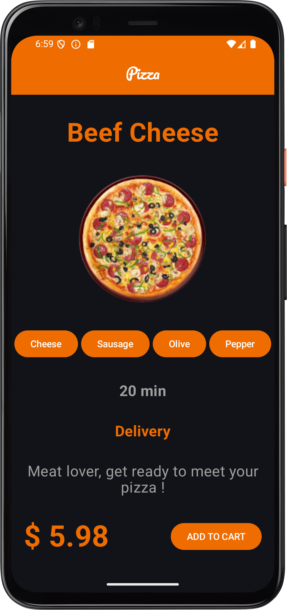

 &nbsp;&nbsp;&nbsp;&nbsp;&nbsp;  

# **Project Description:**

This project is a pizza ordering app screen design developed using Jetpack Compose. The application includes various modern features to enhance the user experience.

## **Technologies and Features Used in the Project:**

**Jetpack Compose:**  The entire user interface is designed with Android's modern UI toolkit.

**Multi-language Support:** The app is available in multiple languages, reaching a broader user base.

**Multi-screen Support:** It functions seamlessly across different screen sizes and resolutions.

**Customized Widgets:** Enriched with app-specific custom widgets.

**Dark Mode Option:** Provides dark mode support to improve user experience.

**Customizable App Icon:** Strengthens brand identity with custom app icons.

**Color and Font Usage:** Uses brand-aligned color palettes and typography.
